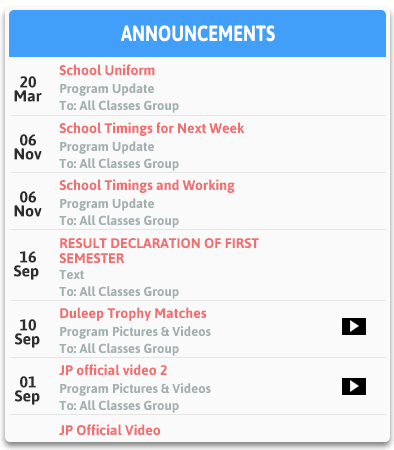
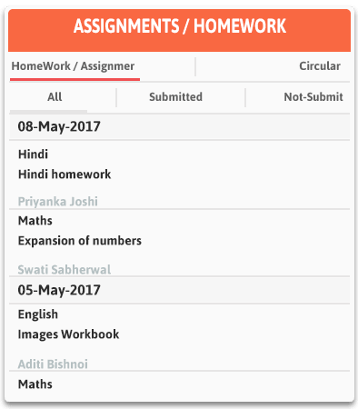

# class management webapp using Spring boot + Angular + postgresql or mysql 

Here you need to identify the schema/model fields by observing the UIs, The goal of this assignment is to build **website** for a **Class Management** site in which you are free to play with as much as possible your sample data.

---

<b>Note:- Above images are only for reference.<b>

### Features:

1. User login for student and class teacher.

-  Student can see only his assignments and announcements.(use permissions and authentication)
-  Teacher can register class and add students in that class.
-  Student can login via email and password.

2. Assignment

- Teacher can Create, Delete and Get all assignments that are assigned by him.
- If a teacher add assignment  then it must be accessible for all students of same class.
- Students should be able to upload solutions in pdf/jpg format.
- Teacher can check assignment and mark them as completed.

3. Announcements  

- Teacher can make  announcement(e.g: holidays, events etc).
- That announcement will be shown for every student of a class.

4. Authentication

- Login (mandatory)
- Logout(optional)
- Signup (mandatory)

- **fork** current problem repository, and make it **private**.
- Brownie points to deployed webapps (If you can, but not mandatory).
- **Add `@divyansh420` as collaborator while intializing repository in github. and follow the given timeline instructions from your mail.**

### Coding Guidelines

- For design ideas and functionality: Please look at https://schoofi.com/ or any other Email Application.
- Focus on the completion of the features.
- You will be evaluated on a **WORKING PROTOTYPE** for the following:
  - UI & design
  - Modularity of Code
  - Data Structures used
  - Logic and cleanliness of code.
  - Completeness.
- Please ask us for any hurdle in your problem assignment.

